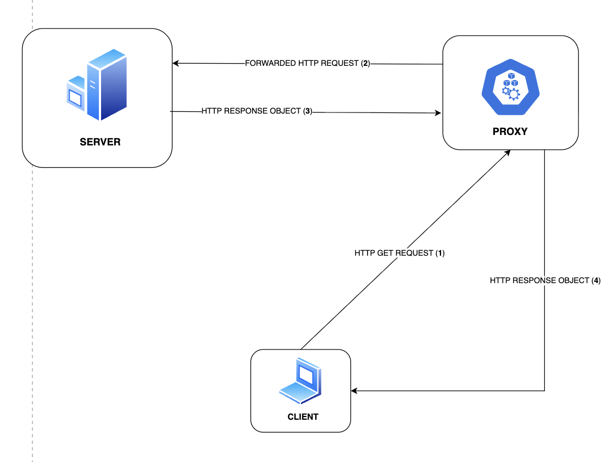

# TDA596-LABS-G35

### MEMBERS:
1) Arvin Allahbakhsh
2) Wills Ekanem
3) Xin Yi

# Project Architecture

# Architecture Breakdown

## Functionality
(SERVER - CLIENT).

| HTTP Method | Description                                                          | Response                          |
|-------------|----------------------------------------------------------------------|-----------------------------------|
| GET         | GET file with valid file extension & existing file                    | Status Code **200**, copy of File |
| POST        | SEND file to server with valid file extension for server download     | Status Code **201**, file stored  |

## Error Handling
Via proxy all other methods except from HTTP GET are not implemented and will return a 501 on requested.

| HTTP Method | Description                  | Expected Response |
|-------------|------------------------------|-------------------|
| POST        | Create a resource            | 501 Not Implemented |
| PUT         | Replace a resource           | 501 Not Implemented |
| PATCH       | Partially update a resource  | 501 Not Implemented |
| DELETE      | Delete a resource            | 501 Not Implemented |
| HEAD        | GET without the response body| 501 Not Implemented |
| OPTIONS     | Discover supported methods   | 501 Not Implemented |
| TRACE       | Diagnostic loopback test     | 501 Not Implemented |
| CONNECT     | Establish tunnel             | 501 Not Implemented |

>> Invalid File/ Invalid File extension Error / Not Implemented

| Error Case              | Description                   | Status Code |
|-------------------------|-------------------------------|-------------|
| Invalid File Extension  | File type not allowed         | 400 Bad Request |
| File Not Found          | Requested file is missing     | 404 Not Found |

## Valid Methods and file extensions
>> Here we list the valid file extension type and allowed method
>  Any request with an invalid file extension returns a BAD Request Error Response OBJ.

| File Extension | Content-Type   | Valid Methods |
|----------------|----------------|------|
| .html          | text/html      | GET  |
| .txt           | text/plain     | GET  |
| .gif           | image/gif      | GET |
| .jpg / .jpeg   | image/jpeg     | GET |
| .css           | text/css       | GET |

## Functionality TEST

### Test Cases

| Test Case Name                   | Expected Result                                   | Actual Response Description                        |
|----------------------------------|---------------------------------------------------|----------------------------------------------------|
| TestGET200                       | Expect **200**                                    | response.status code **200**                       |
| TestGET200_ContentType_JPEG     | Expect header `Content-Type: image/jpeg`          | response body is **JPEG image**                    |
| TestGet400_BadRequest           | Expect **400** (Invalid file extension)           | response.status code **400**                       |
| TestGET404_NotFound             | Expect **404** (File not found)                   | response.status code **404**                       |
| TestGet501_NotImplemented       | Expect **501** (Method Not Implemented)           | response.status code **501**                       |
| TestPost200                     | Expect **200**                                    | response.status code **200**                       |
| TestPost500_NoBoundary          | Expect **500** (Missing multipart boundary)       | response.status code **500**                       |

